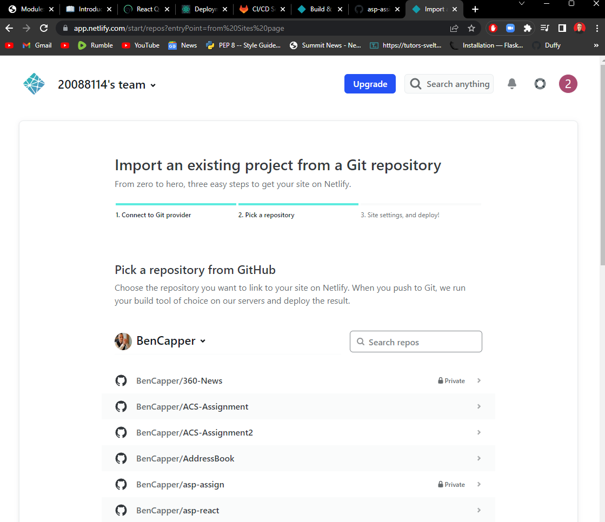

# Assignment 1 - Agile Software Practice.

__Name:__ Ben Capper

This repository contains the implementation of a React App and its associated Cypress tests and GitLab CI pipeline.

## React App Features.
 
+ Firebase authentication and login form
+ Pagination on movie and tv lists
+ Similar movies list in movie details
+ Production company chips in movie details link to company homepage if one exists
+ Trending movies page
+ Must watch pages display movies or tv which the user added to the must watch lists
+ Tv seasons table in tv details page
+ Tv episodes table page linked from a selected tv season
+ Display and write reviews for a tv series 
+ Top rated tv page
+ Search for companies or people based on a user query and form toggle option

## Automated Tests.

### Best test cases.

+ cypress/e2e/reviewForm.cy.js
+ cypress/e2e/details.cy.js

### Cypress Custom commands (if relevant).

+ cypress/e2e/details.cy.js
+ cypress/e2e/favoriteTv.cy.js
+ cypress/e2e/mustWatchPages.cy.js
+ cypress/e2e/navbar.cy.js
+ cypress/e2e/reviewForm.cy.js
+ cypress/e2e/reviewPages.cy.js
+ cypress/e2e/topRatedTv.cy.js
+ cypress/e2e/search.cy.js

## Code Splitting.

+ src/pages/movieReviewPage.js
+ src/pages/tvReviewsPage.js

## Independent learning.

The deployed app can be found here:
    - https://majestic-longma-7d7b32.netlify.app/

**I attempted to use Netlify with Gitlab but it wouldn't let me link to a repo there:**

**Instead, I had to deploy it from a Github version of the repo:**

**This deploys automatically when the main branch is pushed to:**

